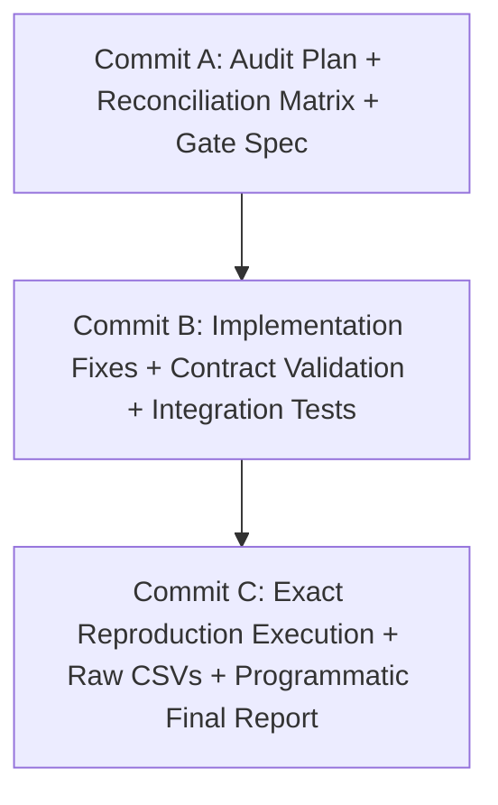

# V3.2.2 AUDIT PLAN: STRICT PRECOMMIT RECONCILIATION & EXACT REPRODUCTION

This document outlines the strict execution protocol for V3.2.2.

---

## 1. OBJECTIVE & SCOPE (AUDIT ONLY — ZERO NEW RESEARCH)

1. **Reconcile every hypothesis implementation against the original Git precommit** (`f5be62deba702fd737149c64b5faca3599f0daca` / `V3_2_PRECOMMIT_H204_PLUS.md`).
2. **Eliminate all hypothesis drift** (remove uncommitted extra filters in H-204, H-206, and decouple H-208A/H-208B from H-204).
3. **Align evaluation gates strictly with the precommitted gates** (Gate A to Gate E).
4. **Implement reusable runtime strategy contract validation** (`validate_strategy_output()`).
5. **Expand end-to-end engine integration test suite** and capture comprehensive test execution logs.
6. **Programmatically generate all reports and summaries directly from machine-readable raw data** with zero manual transcript copying.

---

## 2. WORKFLOW & COMMIT PROTOCOL

- **Commit A**: Stage all reconciliation documentation, audit plan, and test specifications.
- **Commit B**: Stage engine contract validation layer, repaired signal implementations, and integration test execution evidence.
- **Commit C**: Stage raw machine-readable simulation outputs, exact reproduction summary CSV, and programmatic final report.
